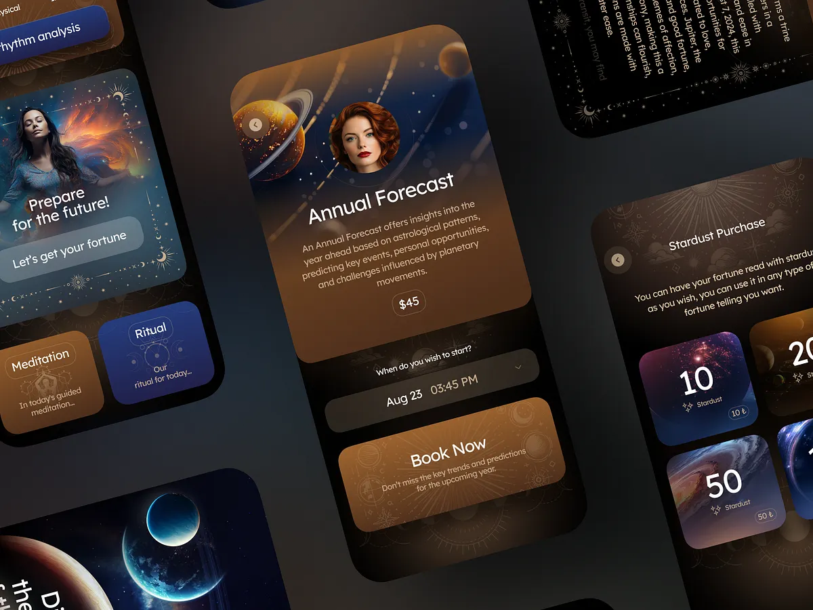
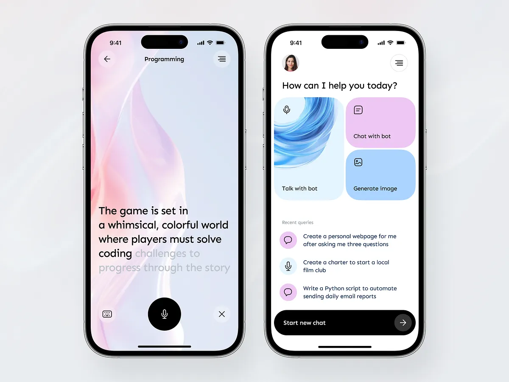
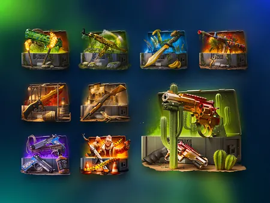
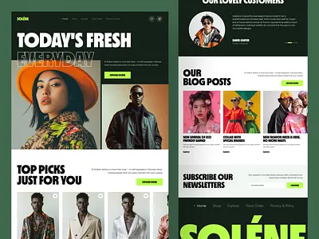
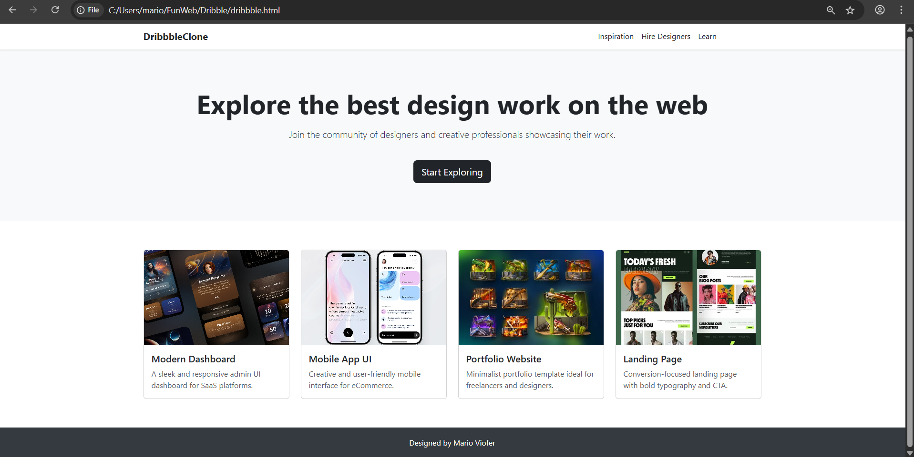

# Project Responsive Web Design using Bootstrap
## Date:18/05/2025

## AIM:
To create a simplified clone of Dribbble (https://dribbble.com/) landing page.

## DESIGN STEPS:

### Step 1:
Clone the repository from GitHub.

### Step 2:
Create Django Admin project.

### Step 3:
Create a New App under the Django Admin project.

### Step 4:
Insert the necessary CSS and JavaScript files as external in order to use Bootstrap.

### Step 5:
Create a HTML file and include the needed Bootstrap components.

### Step 6:
Publish the website in the LocalHost.

## PROGRAM :

~~~
<!DOCTYPE html>
<html lang="en">
<head>
  <meta charset="UTF-8" />
  <meta name="viewport" content="width=device-width, initial-scale=1" />
  <title>Dribbble Clone</title>
  <link href="https://cdn.jsdelivr.net/npm/bootstrap@5.3.2/dist/css/bootstrap.min.css" rel="stylesheet">
  
</head>
<body>

  <nav class="navbar navbar-expand-lg navbar-light bg-white shadow-sm">
    

      <a class="navbar-brand fw-bold text-dark" href="#">DribbbleClone</a>
      <button class="navbar-toggler" type="button" data-bs-toggle="collapse" data-bs-target="#navbarNav">
        
      </button>
      

        <ul class="navbar-nav">
          <li class="nav-item"><a class="nav-link text-dark" href="#">Inspiration</a></li>
          <li class="nav-item"><a class="nav-link text-dark" href="#">Hire Designers</a></li>
          <li class="nav-item"><a class="nav-link text-dark" href="#">Learn</a></li>
          <li class="nav-item"><a class="nav-link btn btn-dark text-white ms-3" href="#">Sign up</a></li>
        </ul>
      

    

  </nav>

  <section class="hero">
    

      <h1 class="display-4 fw-bold">Explore the best design work on the web</h1>
      
Join the community of designers and creative professionals showcasing their work.

      <a href="#" class="btn btn-dark btn-lg mt-4">Start Exploring</a>
    

  </section>

<section class="gallery">
  

    

      

        

          
          

            <h5 class="card-title">Modern Dashboard</h5>
            
A sleek and responsive admin UI dashboard for SaaS platforms.

          

        

      

      

        

          
          

            <h5 class="card-title">Mobile App UI</h5>
            
Creative and user-friendly mobile interface for eCommerce.

          

        

      

      

        

          
          

            <h5 class="card-title">Portfolio Website</h5>
            
Minimalist portfolio template ideal for freelancers and designers.

          

        

      

      

        

          
          

            <h5 class="card-title">Landing Page</h5>
            
Conversion-focused landing page with bold typography and CTA.

          

        

      

    

  

</section>

  <footer>
    

      
Designed by Mario Viofer

    

  </footer>

  
</body>
</html>

~~~

## OUTPUT:

## RESULT:
The Project for responsive web design using Bootstrap is completed successfully.
